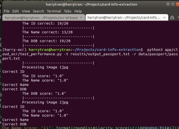

## Card Info Extraction

# Test the result 

<b>Run the commands to view the test result (Card ID, Name, DOB)</b>

```
git clone git@git.base.vn:huytran/card-info-extraction.git && cd card-info-extraction
python3 virtualenv -p python3 <NAME-ENV>
source <NAME-ENV>/bin/activate
pip install -r requirements.txt 
python3 app/cloud_ocr/test_performance.py -t <test_file> -r <reference_file>
```

<b> We have each pair of files like this (test_file - reference_file)</b>

```
(results/output_test.txt - data/test_data/test.txt)
(results/output_train.txt - data/train_data/train.txt)
(results/output_old_card.txt - data/old_card/old_card.txt)
(results/output_passport.txt - data/passport/passport.txt)
```




[Data For Images](https://drive.base.vn/huytran02-drive?show=186234)